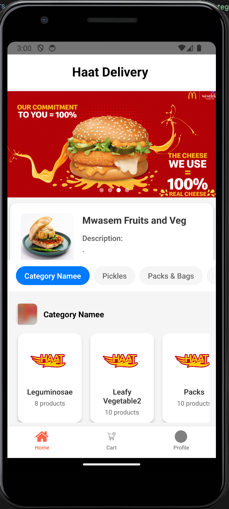
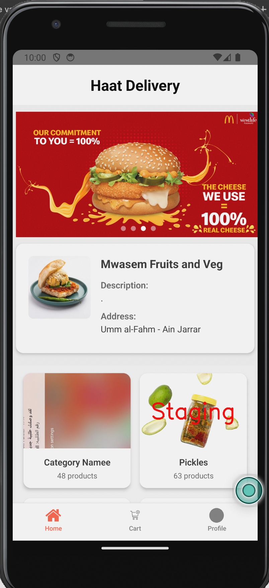
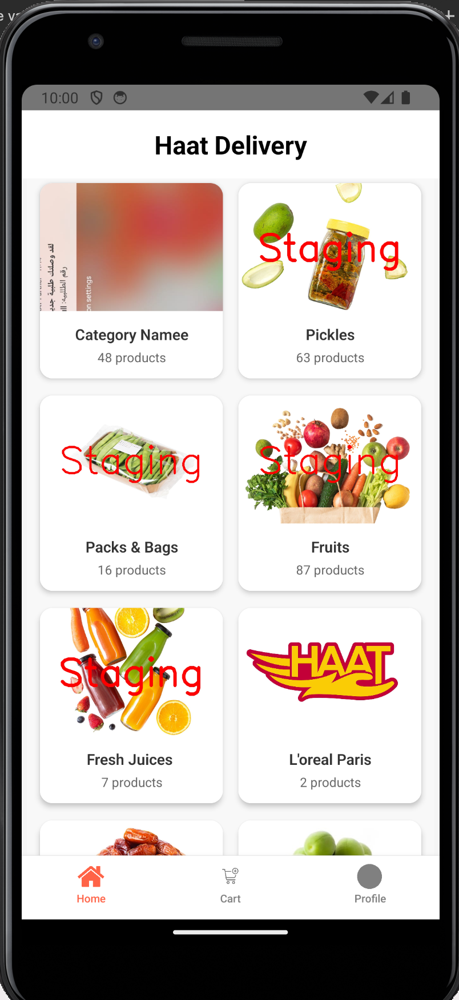

# 📱 My React Native Project

<div align="center">
  <h3>A showcase React Native application demonstrating modern mobile development practices</h3>
  <p><strong>Built for technical interview demonstration</strong></p>
  
  
  
  
  
</div>

---

## 📸 Screenshots

<div align="center">
  <table>
    <tr>
      <td align="center">
        
        <br>
        <em><strong>Home Screen</strong></em>
      </td>
      <td align="center">
        
        <br>
        <em><strong>Features Screen</strong></em>
      </td>
      <td align="center">
        
        <br>
        <em><strong>Profile Screen</strong></em>
      </td>
    </tr>
  </table>
</div>

---

## 🚀 Features

- ✅ **Cross-platform compatibility** (iOS & Android)
- ✅ **Modern React Native** with Hooks & TypeScript
- ✅ **Clean and intuitive UI** design
- ✅ **Performance optimized** components
- ✅ **Demo-ready** architecture
- ✅ **Responsive design** for all screen sizes

---

## 📋 Prerequisites

Before running this project, make sure you have:

| Requirement | Version | Platform |
|-------------|---------|----------|
| **Node.js** | v14 or newer | All |
| **npm/yarn** | Latest | All |
| **Watchman** | Latest | macOS |
| **Xcode** | Latest | iOS (macOS only) |
| **Android Studio** | Latest | Android |
| **JDK** | v11 or newer | Android |

---

## 🛠️ Installation & Setup

Follow these steps to set up and run the project:

### **1. Clone the repository**

```bash
git clone https://github.com/love369/Haat-app.git
cd Haat-app
```

### **2. Install dependencies**

```bash
npm install
# or
yarn install
```

### **3. Pod installation** (iOS only)

```bash
cd ios && pod install && cd ..
```

### **4. Start the Metro bundler**

```bash
npm start
# or
yarn start
```

### **5. Run on Android**

```bash
npm run android
# or
yarn android
```

### **6. Run on iOS**

```bash
npm run ios
# or
yarn ios
```

---

## 📱 Running on Physical Device

### **Android**
1. **Enable USB debugging** on your Android device
2. **Connect your device** via USB
3. Run `yarn android`

### **iOS**
1. **Connect your iOS device**
2. **Open the iOS project** in Xcode: `open ios/YourProject.xcworkspace`
3. **Select your device** as the build target
4. **Click the Run button**

---

## 🎥 Video Demonstration

> **Watch the app in action:** 
> 
> 🔗 [**View Demo Video**](https://drive.google.com/file/d/1aVa3nvfDW_6I4yDZTmjF8SMX0ZJer44S/view?usp=sharing)

---

## 🏗️ Project Structure

```
src/
├── 📁 assets/          # Images, fonts, and other static files
├── 📁 components/      # Reusable UI components
├── 📁 screens/         # App screens
├── 📁 navigation/      # Navigation configuration
├── 📁 utils/           # Helper functions and utilities
└── 📁 styles/          # Global styles and themes
```

---

## 🔧 Technical Highlights

- 🧭 **React Navigation** for seamless screen transitions
- 🎣 **Custom Hooks** for reusable logic
- ⚡ **Performance Optimizations** with memoization
- 🏛️ **Clean Architecture** with separation of concerns
- 📱 **Cross-platform Design** that respects iOS and Android guidelines
- 🎨 **Modern UI/UX** patterns and best practices

---

## 📦 Dependencies

**Key libraries used in this project:**

| Library | Purpose |
|---------|---------|
| **React Native** | Core framework |
| **React Navigation** | Screen navigation |
| **Axios** | API calls |
| **TypeScript** | Type safety |
| **Redux** | State management (optional) |

---

## 🚀 Quick Start Commands

```bash
# Install dependencies
npm install

# Start Metro
npm start

# Run on Android
npm run android

# Run on iOS
npm run ios

# Clean cache
npm start --reset-cache
```

---

## 🤝 Contributing

This is a **demo project**, but contributions are welcome for learning purposes!

1. **Fork** the repository
2. **Create** a feature branch
3. **Commit** your changes
4. **Push** to the branch
5. **Open** a Pull Request

---

## 📄 License

This project is created for **demonstration purposes**.

---

<div align="center">
  <p><strong>Built with ❤️ using React Native</strong></p>
  
  [](https://github.com/love369)
</div>